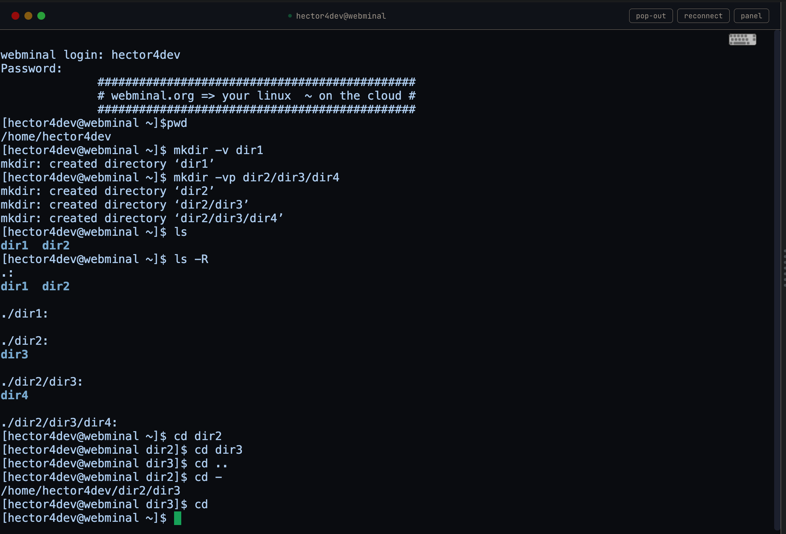
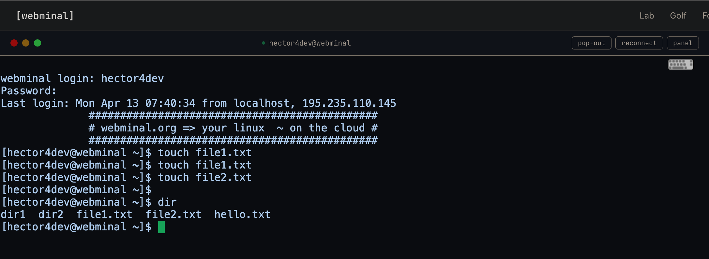
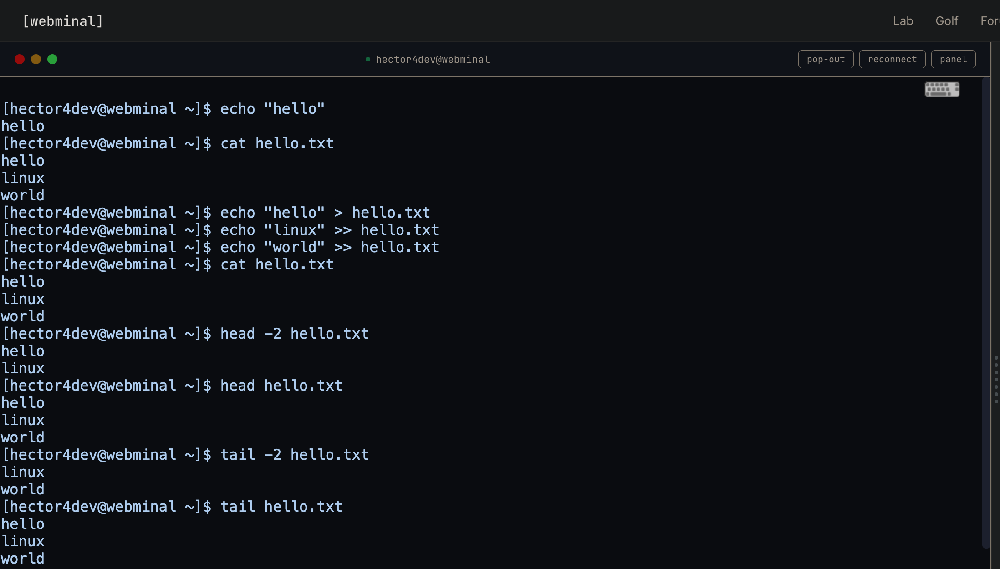
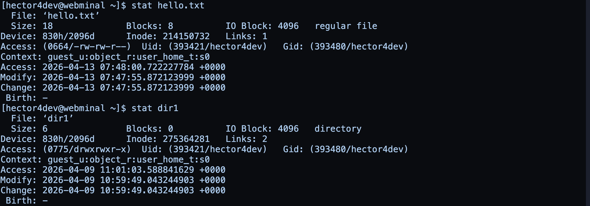
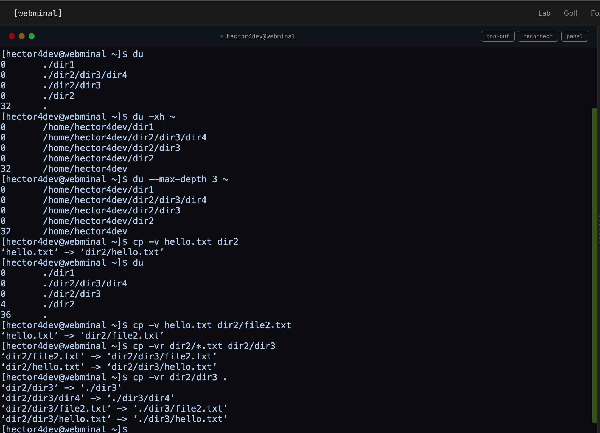
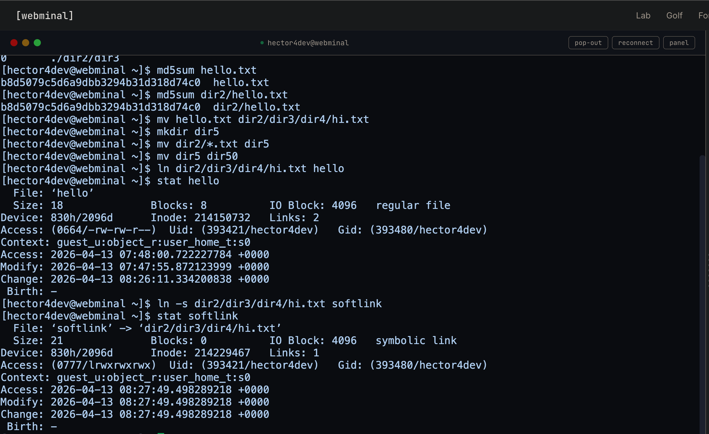
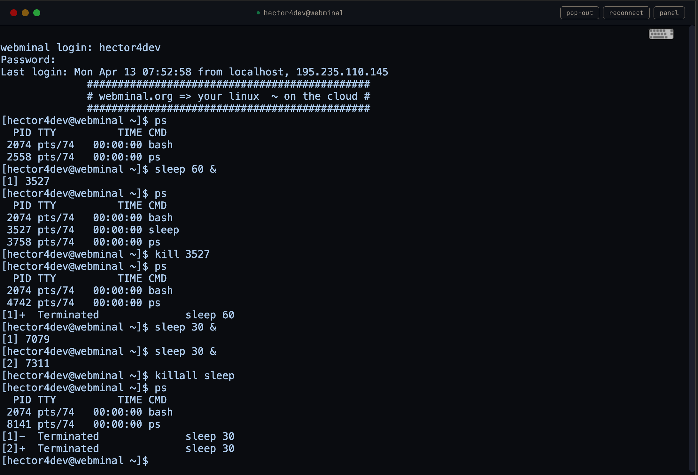

# **Exercici pràctic 2: Webminal**

## Context
Webminal és un joc per practicar les ordres del terminal Linux. Amb aquest joc aprendràs les ordres més comuns.

## Objectius d’aprenentatge
- Practicar amb las ordres executades des del terminal Linux.

## Resultat

Lesson-01

---
---
Lesson-02

---

---
---
Lesson-03

---

---

---
---
Lesson-04

---