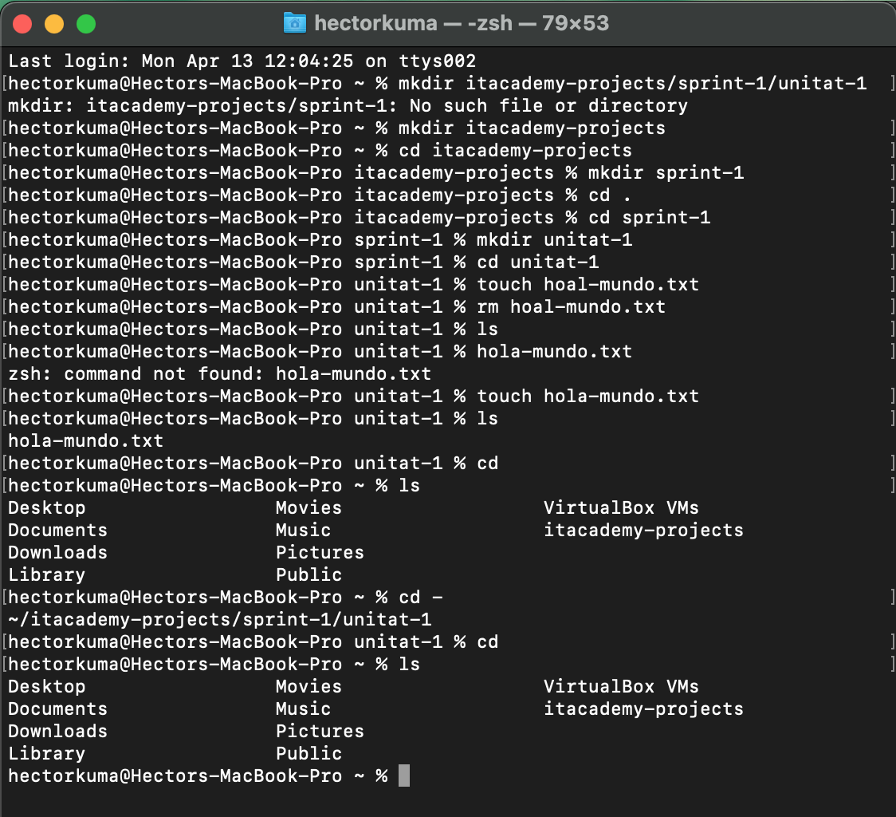

# **Exercici pràctic 3: Fitxers i Directoris**

## Context
Amb aquest exercici practicaràs les ordres bàsiques per navegar eficientment per l’estructura del sistema i gestionar fitxers i directoris en entorns Unix/Linux.

## Objectius d’aprenentatge
- Navegar i gestionar directoris i l’estructura del sistema.
- Manipular fitxers amb precisió.

## Passos a seguir
1. Navegació
   - Mostra tots els fitxers (inclosos els ocults) del vostre directori arrel (/ o ~).
   - Navega al directori on vols començar a desar els projectes de la ItAcademy.
2. Creació d'estructura
   - Crea una carpeta nova anomenada itacademy-projects al directori arrel.
   - Accedeix a la carpeta itacademy-proyectos.
   - Dins d'aquesta carpeta crea una subcarpeta anomenada sprint-1
   - Accedeix a la carpeta sprint-1.
   - Dins de sprint-1 crea una altra subcarpeta anomenada unitat-1
   - Accedeix a la carpeta unitat-1.
   - Crea un fitxer anomenat hoal-mundo.txt.
  
3. Gestió d'errors
   - Elimina el fitxer mal escrit (hoal-mundo.txt).
   - Crea un nou fitxer anomenat hola-mundo.txt.
   - Verifica el contingut del directori actual
   - Retorna al directori arrel sense usar la ruta completa.
   - Verifica el contingut del directori arrel

## Resultat
