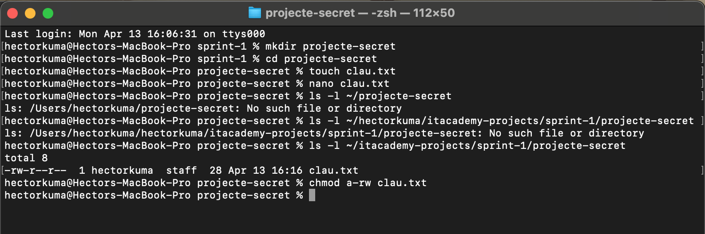
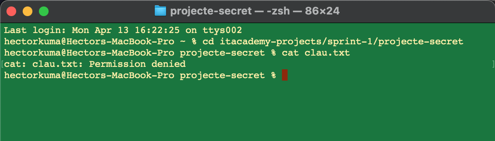
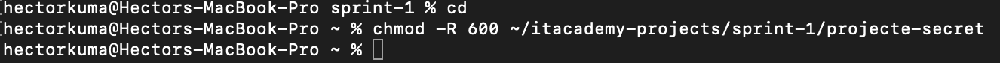
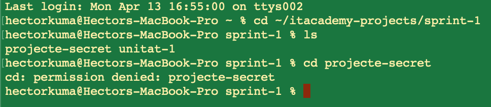

# **Exercici pràctic 4: Ordres Avançades**

## Context
En aquest taller aprendràs a utilitzar ordres avançades del terminal per gestionar permisos de fitxers, directoris en entorns Unix/Linux.

## Objectius
- Entendre i modificar permisos

## Passos a seguir
1. Preparació inicial
   - Dins de sprint-1 crea una nou directori un directori nou anomenat projecte-secret.
   - Dins de projecte-secret, crea un fitxer anomenat clau.txt amb el contingut: "Això és una clau secreta!" (Recorda que el text l'has d'inserir al document mitjançant l'ús de la terminal)
2. Verificació de permisos actuals
   - Executa ls -l ~/projecte-secret i observa els permisos del fitxer clau.txt (ex: -rw-r--r--).
3. Modificació de permisos
   - Canvia els permisos de clau.txt perquè només el propietari pugui llegir-lo i escriure’l
4. Simulació d’accés denegat
   - Obre una nova terminal o canvia d’usuari (opcional amb su).
   - Intenta llegir el fitxer amb. (Resultat esperat: Permission denied)
5. Gestió de permisos per a directoris
   - Canvia els permisos del directori projecte-secret perquè només el propietari hi pugui accedir:
   - Verifica que altres usuaris no puguin veure el contingut del directori.

## Resultat

