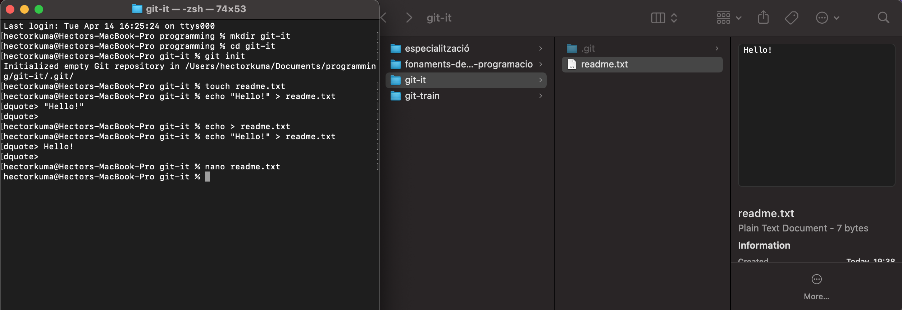
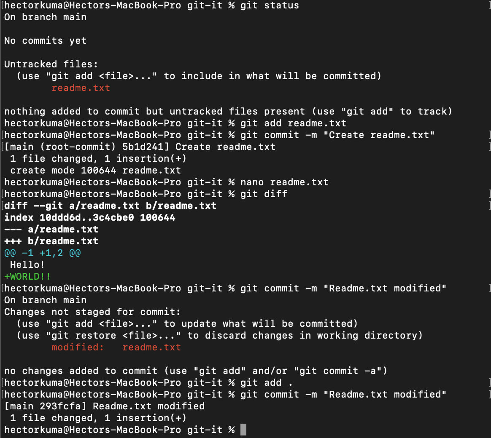
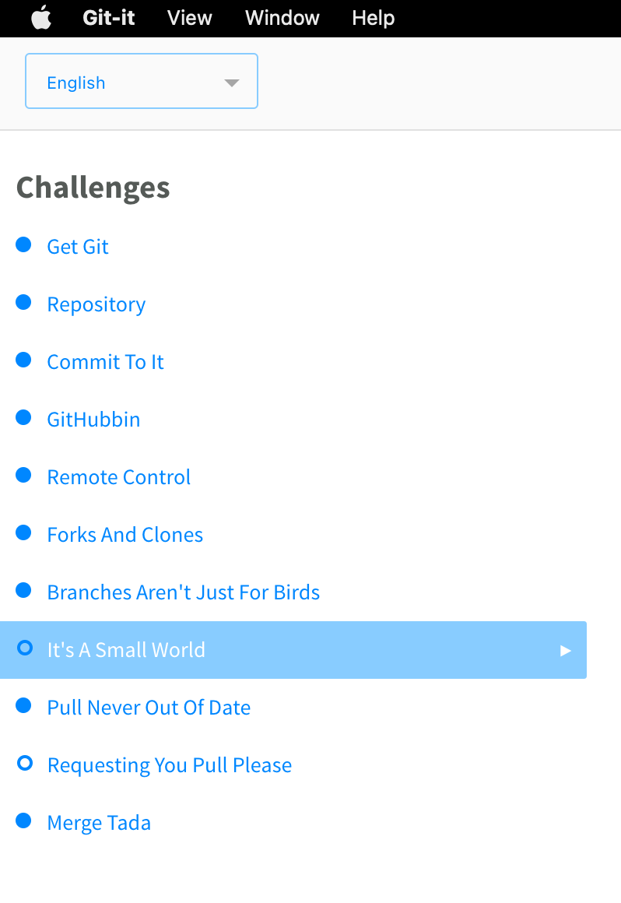

# **Exercici pràctic 06: Git-it-electron**

## Context

Aquesta aplicació inclou reptes per aprendre Git i GitHub utilitzant l’entorn real de Git i GitHub, no emuladors. Aprendràs a utilitzar la línia de ordres, que és increïble (i no tan terrorífica), i GitHub. Això vol dir que, quan completis tots els reptes, tindràs repositoris reals al teu compte de GitHub i quadrats verds al teu gràfic de contribucions.

## Objectius d’aprenentatge

- Ordres bàsics de Git.
- Treballar amb branques de Git.
- Fer pull-request a GitHub.

## Passos a seguir

1. Instal·la el joc des de sourceforge o desde el mateix repositori de github
2. Completa els reptes del joc.

## Resultat

Enllaç al repositori: [repo-patchwork](https://github.com/hectordev4/patchwork)

