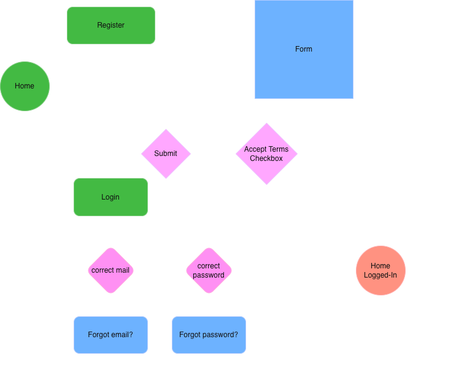

# Exercici pràctic 8: Registre d'usuaris

## Context

Una aplicació web permet registrar usuaris mitjançant un formulari (email i contrasenya). El flux inclou validacions, errors i interaccions entre components.
Crear un diagrama de flux que representi el procés complet de registre d'usuari, incloent camins alternatius i punts de decisió.

## Objectius d'aprenentatge
1. Representar processos complexes amb diagrames de flux
2. Utilitzar eines visuals o code-first per a documentació tècnica
3. Identificar punts de fallada i camins alternatius

## Passos a seguir

1. Tria una eina de diagramació
   - Code-first: Mermaid.js (sintaxi Markdown )
   - Visual: Draw.io, Excalidraw o Lucidchar
2. Crea el diagrama de flux
   - Elements obligatoris
   - Nodes
   - Inici/Fi
   - Operacions (ex: "Usuari omple formulari")
   - Decisions (ex: "Dades vàlides?")
   - Connexions amb fletxes
   - Camins
   - Flux principal (registre exitós)
   - 2 camins alternatius (ex: email invàlid, error de connexió)

3. Afegir complexitat (Bonus)
   - Inclou 3 nivells de validació: format email, força contrasenya, disponibilitat email
   - Afegeix un sistema de reintents després d'errors

4. Documentació
   - Integra el diagrama als apunts
   - Explica en 2-3 línies les decisions de disseny més rellevants

## Resultat

